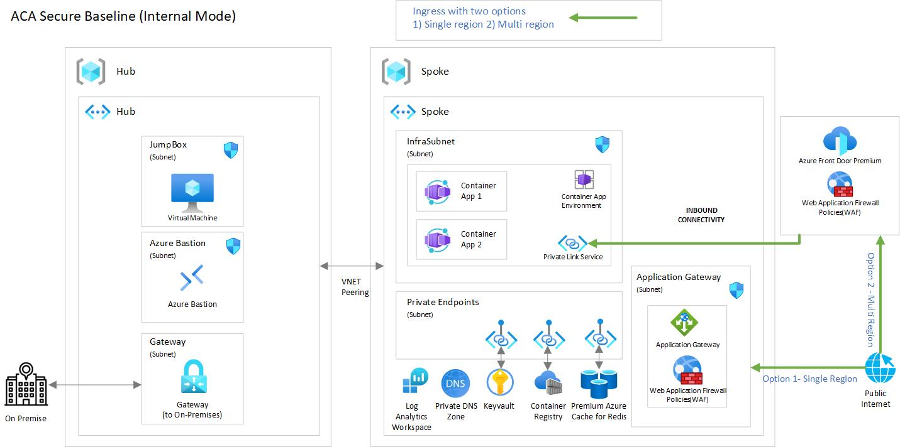

# Scenario 1: Azure Container Apps - Internal environment secure baseline

This reference implementation demonstrates a *secure baseline infrastructure architecture* for a microservices workload deployed into [Azure Container Apps](https://learn.microsoft.com/azure/container-apps). Specifically this scenario addresses deploying Azure Container Apps into a [virtual network](https://learn.microsoft.com/azure/container-apps/vnet-custom-internal), and has no public endpoint.

Azure Container Apps-hosted workloads typically experiences a separation of duties and lifecycle management in the area of prerequisites, the host network, the cluster infrastructure, and finally the workload itself. This reference implementation steps are created by keeping that in mind. Also, be aware our primary purpose is to illustrate the topology and decisions of a baseline cluster. We feel a "step-by-step" flow will help you learn the pieces of the solution and give you insight into the relationship between them Ultimately, lifecycle/SDLC management of your cluster and its dependencies will depend on your situation (team roles, organizational standards, tooling, etc), and must be implemented as appropriate for your needs.

By the end of this deployment guide, you would have deployed an "internal environment" Azure Container Apps cluster. You will will also deploying a sample web app. This implementation is not expected to be your first exposure to Azure Container Apps, if you're looking for introductory material, please complete the [Implement Azure Container Apps](https://learn.microsoft.com/training/modules/implement-azure-container-apps/) training module on Microsoft Learn.



## Core architecture components

- Azure Container Apps
- Azure Virtual Networks (hub-spoke)
- Azure Container Registry
- Azure Bastion
- Azure Application Gateway (Web Application Firewall)
- Azure Key Vault
- Azure Private Endpoint
- Azure Private DNS Zones
- Log Analytics Workspace
- Azure Cache for Redis (optional deployment, see [Deployment parameters](./bicep/README.md#standalone-deployment-guide), default is false)

## Deploy the reference implementation

```bash 
cd scenarios/aca-internal/bicep

LOCATION=northeurope # or any location that suits your needs
LZA_DEPLOYMENT_NAME=bicepAcaLzaDeployment  # or any other value that suits your needs

```bash
az deployment sub create \
    --template-file main.bicep \
    --location $LOCATION \
    --name $LZA_DEPLOYMENT_NAME \
    --parameters ./main.parameters.json